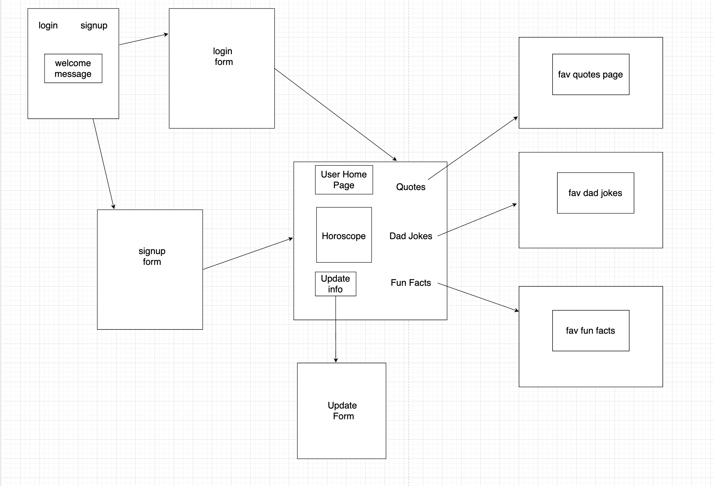
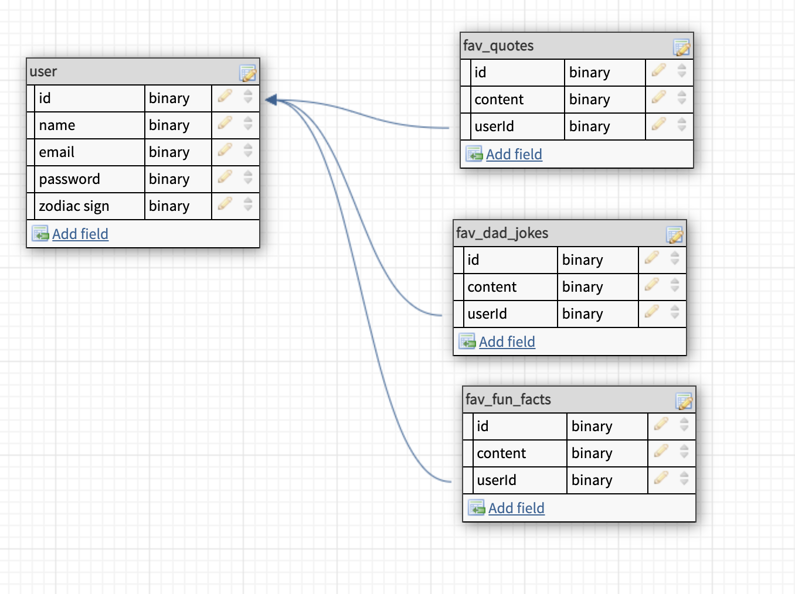
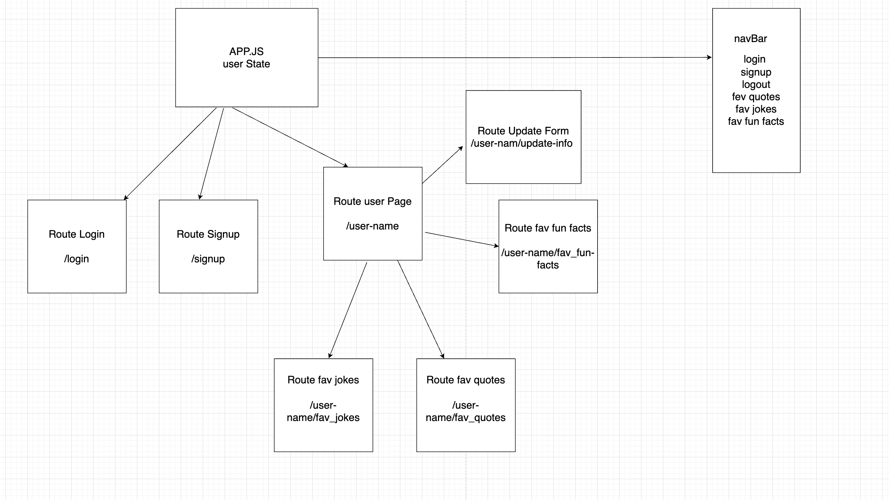

# daddy-2.0

Best Dad 2.0

This App is created for those akward moments where a dad needs to do/say something to break the ice or just embarass the kids in front of their friends.

It provides random dad jokes, famouse quotes or fun facts that a user can save in databases if considers them intersting or fun enough. (In the way that can be reused in future momemts)

The user home page will also provides a daily horoscope, automatically created at the login based on the user sign, with the option of picking a different sign (in case mom wants to know her horoscope).

User stories:

-In the home page, the user can click on login  or signup links, once these links are clicked the user will be redirect to the login or signup forms.

-In the signup form the user will be asked to type name, zodiac sign, email and password, once the user click the signup button, a user row will be created in the user table in the backend.

-In the login form, the user can type user name and password that will redirect the user to the user personal page, once the login button will be clicked.

-In the user page the user will see the daily horoscope and some random dad jokes, fun facts and quotes created using an api call to 3 differents api's.

-The user will be able to click a button to randomly "fetch" new jokes, facts or quotes.

-The user will be able to click another button to save the quotes, jokes, and facts in different backend tables.

-The user can navigate from the navigation bar to all the jokes, all the quotes, all the fun facts saved, by clicking on the different links.

-The user can also look for a different daily horoscope, by typing the sign in a specific input field.

|Routes                     | HTTP Verb                       | URL                            |
| :----------------------: | ------------------------------- | ------------------------------- |
| userRoute | .post | 'user/' |
| userRoute | .post | 'user/login' |
| userRoute | .get | 'user/verify' |
| userRoute | .put | 'user/' |
| favJokeRoute | .get | '/jokes/:userId' |
| favJokeRoute | .post | '/jokes/:userId' |
| favJokeRoute | .delete | '/jokes/:userId/:jokeId' |
| favQuotesRoute | .get | '/quotes/:userId' |
| favQuotesRoute | .post | '/quotes/:userId' |
| favQuotesRoute | .delete | '/quotes/:userId/:quoteId' |
| favFactsRoute | .get | '/facts/:userId' |
| favFactsRoute  | .post | 'facts/:userId' |
| favFactsRoute  | .delete | 'facts/:userId/:factId' |

MVP:

-The site has user authentication functionality.

-Each user can login and serch for new jokes facts and quotes.

-Each user can save and look  favorite jokes facts and quotes.

-Each user can update the user name, zodiac sign.

-Each user can see only their own favorite jokes facts and quotes.

Stretch goals:

-user will be able to load picture from the computer

-make the app mobile "friendly"

-use encryptions for the password and email.

